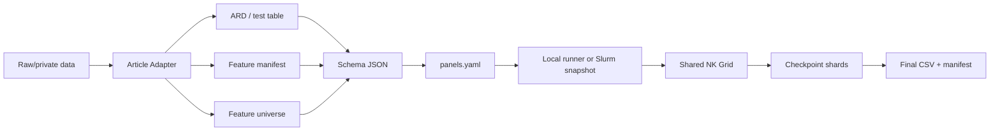

# Adapter → NK Grid 工作流加固方案

日期：2026-07-27
状态：方案审核稿，尚未实施
适用范围：根目录共享 `NK_Grid/`、`SMR/adapter/`、`FFCWS/adapter/`
Git 状态：本方案不授权提交；审核通过后再拆分实施

基线说明：文档审核期间，工作区同时出现了尚未提交的 SMR 和 FFCWS Adapter
现代化重构。这些并发修改不是本方案的实施结果，必须先单独落定和审核，本方案的
change set 1 才能开始，避免在同一文件上发生语义和实现冲突。

- SMR：删除 `SMR/NK_Grid` legacy fork，以 `SMR/adapter/prepare.py` 替代旧
  `prepare_smr.py`，引入固定 feature contract，并调用共享
  `canonical_feature_universe()` / `validate_input()`。
- FFCWS：包路径从
  `FFCWS/adapter/data_processor/src/ffcws_data_processor/` 移到
  `FFCWS/adapter/src/ffcws_data_processor/`；入口改为
  `FFCWS/adapter/prepare.py`；contract 改为
  `FFCWS/adapter/contracts/ffc.yaml`；旧 prepare 脚本已经删除。
- 当前 FFCWS 重构已经保留 outcome 缺失行、直接 import engine 的 canonical
  实现，并对生成的 schema/outcome 调用 `validate_input()`；这些不再列为本方案
  尚未实现的工作，但仍需作为并发修改单独回归。
- 同一次 FFCWS 重构还**有意识地保留并重写了 outcome-specific masking**：
  `contract.py::enforce_outcome_train_category_coverage()` 会在函数内部重新推导
  outcome-observed train/test subset，调用点仍在 `pipeline.py`。因此 change set 1
  若采纳三层类别策略，删除 masking 是推翻一项刚写下且有明确 docstring 理由的设计
  决定，不是机械清理遗留代码；必须先与该并发重构作者对齐并记录结论。

## 1. 执行摘要

当前架构的基本边界是正确的：

- 文章 Adapter 负责 raw data → ARD、feature manifest、feature universe、
  schema 和 provenance。
- `panels.yaml` 只负责实验运行控制。
- 根目录 `NK_Grid/` 负责输入验证、split、N/K sampling、cell 内预处理、
  模型、指标、checkpoint、失败治理和最终输出。
- Slurm 使用冻结 snapshot，将任务拆为 panel × model，并按资源类型提交。

需要改进的不是重新拆分目录，而是在 Adapter 和 NK Grid 之间增加一个强制的
“验证、发布、冻结、验收”门禁。目前最重要的缺口是：

1. Q1 已可直接批准：Adapter 保留 outcome 缺失行，engine 统一审计和删除；当前
   FFCWS 重构已经这样做。
2. 真正的 blocking 是类别策略：engine 在 outcome 过滤后对 train/test category
   coverage 硬失败，导致“不按 outcome missingness 重写 test”的方案目前跑不通；
   全局硬失败又与 N/K cell 内静默放行 unseen category 相互矛盾。
3. FFCWS 当前为每个 outcome 写一份完整 ARD。Q1 与 Q2 三层策略都通过后，可把
   每个 strategy 的 6 份物理表降为 1 份，同时保留 2 个 task-specific schemas；
   总体约降到原来的 1/6。该收益严格依赖取消 outcome-specific masking。
4. `--dry-run` 只做配置和规模估算，不验证 ARD、manifest、模型依赖和运行环境。
5. Adapter 直接覆盖正式产物，中断时可能产生跨代文件组合。
6. Slurm snapshot 冻结了配置路径，但没有锁定所有输入内容和 engine commit。
7. 原生模型隔离能处理 crash，但没有 cell timeout；默认失败阈值也没有区分
   native crash 与普通拟合错误。
8. 固定 `batch_size=20` 对快速模型合适，但对耗时差异很大的原生模型不够灵活。
9. `not_releasable` 还没有 snapshot-level 落点；初版只需最小 JSON status 和 QA
   report，不需要提前实现 RSS、ETA 等丰富运行遥测。

建议按四个独立变更批次实施，避免把 Adapter 语义修正、运行时可靠性和运维工具混在
一个难以审核的提交中。

## 2. 当前工作流与责任边界



### 2.1 Adapter 当前拥有的职责

- 特殊缺失码 → `NaN`。
- 确定性的行级转换。
- 分类/序数词表和 raw-source 到 predictor 的映射。
- ARD、test table、feature manifest、feature universe、schema 和 provenance。
- 外部官方 train/test split 的原样保留。

Adapter 不应进行：

- 基于完整数据的插补或标准化。
- N/K sampling。
- 随机 train/test split。
- 模型拟合或指标计算。
- 为了方便而提前删除 outcome 缺失行。

### 2.2 NK Grid 当前拥有的职责

- Schema、ARD、manifest、universe 和 provenance 验证。
- outcome 缺失率和可用样本量验证。
- internal split 或 external split 加载。
- N/K grid 和确定性 draws。
- 每个 training cell 内的插补、标准化和模型拟合。
- checkpoint、resume、failure policy、finalization 和结果 QA。

### 2.3 当前已具备的保护

- schema 是唯一语义入口，panel 不能覆盖 schema 字段。
- 大规模运行需要显式 `--allow-large-run`。
- production 要求 clean Git worktree。
- Slurm snapshot 是只读文件，panel × model 输出路径在一个 snapshot 内必须唯一。
- Slurm 任务按 `parallel`、`serial`、`bart` 拆分。
- 每个 output 有 writer lease。
- batch checkpoint 原子发布，每 50 个 loose shards 压缩。
- USR1 checkpoint-boundary stop、watchdog 和 requeue。
- 当前未提交风险修复增加了 SQLite 流式 finalization 和原生子进程隔离。
- 当前并发的 SMR 和 FFCWS 修改都已直接使用共享
  `canonical_feature_universe()`，并在 Adapter 完成后执行 `validate_input()`；
  是否接受这两组修改需要独立审核。

## 3. 已确认的缺口

### G1. Outcome 行策略已明确，但 engine 类别策略仍阻塞

Q1 可以直接批准：Adapter 保留 outcome 缺失行，由 engine 统一审计和删除。engine
已经在 `validate_input.py::_outcome_observed()` 中先检查 missing ratio，再分别对
train/test 执行 `dropna(subset=[outcome])`。Adapter 再做一次
`merged[outcome].notna()` 只会重复删除，并使 missing ratio 恒等于零。当前 FFCWS
重构已经移除了这次重复删除。

Q2 不能被当作与 Q1 独立的 Adapter 选择。当前 engine 在过滤 outcome 后调用
`_validate_external_category_coverage(train, test, groups)`；如果 outcome-observed
test 中存在 outcome-observed train 没有的 category，它会直接 `raise`。因此，直接
删除 FFCWS 的 outcome-specific masking 会让 panel 在第一个 cell 前失败。

此外，全局检查与 per-cell 行为不一致：N/K sampling 后，一个小 N cell 缺少某些合法
training-pool categories 是常态，但 `preprocess_cell()` 只插补 NaN，对 unseen 的
非缺失 one-hot/ordinal 状态静默放行。必须先回答全局检查是在防 Adapter bug，还是在做
方法学保证，并为全局 vocabulary、outcome-observed subset 和 per-cell subset 分层定义
策略。

FFCWS 当前 `unknown_rate_threshold: 0.95` 同时驱动两个不同语义的 raise：
`common/validation.py::unknown_qa_row()` 用于 raw unknown-code rate，
`contract.py::enforce_outcome_train_category_coverage()` 用于 outcome-specific
coverage/masking rate。它允许一个 source 的 95% 已观测 test 值被抹成 NaN 才失败，
实质上没有形成可辩护的护栏。实施时必须同时处理这两个调用点，不能只改配置或其中
一处。

### G2. dry-run 不是完整 preflight

当前 `--dry-run` 会：

- 解析 panel；
- 检查 outcome 是否在 schema 声明中；
- 解析 preset；
- 估算 cells 和 checkpoint 数。

它不会：

- 读取完整 ARD/test；
- 执行 `validate_input`；
- 验证 outcome missing ratio、ID、one-hot 状态和 ordinal levels；
- 加载每个 model 的可选依赖；
- 测试 native subprocess；
- 检查输出盘空间、SQLite、`flock` 和 Slurm 节点环境。

结果是同一个 Adapter 错误可能在大量 array tasks 获得资源后同时失败。

### G3. Adapter 产物不是事务式发布

SMR 和 FFCWS 当前直接写正式 CSV/Parquet/JSON 路径。如果进程在写入顺序中间退出，
可能出现：

- 新 ARD + 旧 schema；
- 新 manifest + 旧 universe；
- 新 schema + 旧 provenance；
- 截断的 CSV/JSON；
- 部分 outcome/strategy 已更新，其他仍是上一代。

现有 provenance 包含多个 hash，但 engine 只强制验证其中有限字段；它还没有成为完整的
“发布完成标记”。

### G4. Snapshot 冻结路径，不完全冻结内容

snapshot 当前保存：

- panel/model；
- 解析后的 `NKGridConfig`；
- output 路径；
- source manifest 路径。

receipt 额外记录 worker script hash 和部分环境信息。

仍未锁定：

- engine Git commit 或安装包 hash；
- schema 内容 hash；
- model parameters hash；
- ARD/test/manifest/universe/provenance hash；
- Adapter generation ID。

production 的 clean-worktree 检查只能证明“某一时刻工作区干净”，不能证明所有晚启动或
requeue 的 array tasks 使用同一个 commit 和同一批 Adapter artifacts。

### G5. 原生模型缺少 hang/timeout 治理

当前原生子进程可以把 segmentation fault 限制在 child process，但等待结果没有 timeout。
如果 C++ 库不崩溃而是永久 hang：

- parent 不会进入下一个 cell；
- stop flag 只能等当前执行返回；
- Slurm watchdog 最终只能从上一个 batch checkpoint requeue；
- 同一个 cell 可能在每次 requeue 后再次 hang。

### G6. 失败策略没有按错误类别区分

当前主要根据 failed count 和 failed ratio 判断是否超阈值。以下错误不应具有相同语义：

- convergence warning；
- 数据退化导致的正常 skip；
- 普通 Python model fit error；
- native crash；
- native timeout；
- cgroup OOM；
- finalization integrity error。

production 中即使只有一个 native crash，也应明确阻断“结果可发布”状态，而不是仅因为
低于默认绝对失败阈值就继续。

### G7. checkpoint 只有固定 cell 数边界

`batch_size=20` 对多数模型是稳妥默认值，但 cell 耗时可能相差几个数量级。固定边界会造成：

- 快速模型频繁 `fsync`；
- 慢速模型在收到 USR1 后仍要等待剩余 batch；
- 一个慢 batch 可能超过 240 秒 watchdog；
- 强制 requeue 后最多重复 20 个昂贵 cells。

### G8. 缺少统一的运行状态与交付索引

目前查看一次完整实验需要人工整合：

- snapshot/receipt；
- `squeue`/`sacct`；
- stdout/stderr；
- `.parts`；
- result CSV；
- result manifest。

没有一个命令能回答“哪些 panel/model 完成、哪些在等待、失败原因是什么、是否已经通过
最终 QA”。

### G9. Canonical contract 重复实现已由并发重构消除

当前 SMR `prepare.py` 和 FFCWS
`adapter/src/ffcws_data_processor/contract.py` 都直接从 engine 的
`validate_input.py` import `canonical_feature_universe()`。不需要新增
`adapter_contract.py` 做纯 re-export，也不应搬迁现有函数而破坏 SMR 的 import。

本方案只要求把该直接 import 作为受支持的公共接口并增加回归测试。原来引用已删除
legacy fork 的 tests 已在并发清理中删除，仍需随各自重构单独审核。

## 4. 目标工作流


目标原则：

1. 未通过 Adapter contract 的产物不能成为正式输入。
2. 未通过 preflight 的任务不能提交 Slurm。
3. snapshot 创建后，任何输入或代码变化都必须使 worker fail fast。
4. production 运行不得静默接受 native crash、timeout 或输出完整性错误。
5. checkpoint 边界同时受 cell 数和时间约束。
6. 每个 snapshot 都能生成一份统一、机器可读的最终交付报告。

## 5. 改进方案 A：统一 Adapter 语义

### A1. Q1 直接批准：Adapter 保留 outcome 缺失行

正式规则固定为：

- ARD train/test 保留 outcome 缺失行。
- Adapter 记录原始行数、outcome 已观测数、缺失数和缺失率，但不因 outcome 改变行集合。
- Engine 在 `_outcome_observed()` 中先审计 missing ratio，再删除当前 outcome 缺失行。
- Predictor vocabulary 只能来自官方 training pool，不能依赖 outcome 数值或 missingness。

这是去除重复劳动，不改变 engine 最终用于拟合的 outcome-observed 行集合。当前 FFCWS
并发重构已实现该行为；change set 1 负责确认 contract、测试和文档一致。

### A2. Q2 重述为 engine unknown-category policy

推荐采用三层策略：

| 层级 | “未见类别”的含义 | 推荐处理 |
|---|---|---|
| 官方完整 training pool | test raw state 不在官方 train vocabulary | contract hard fail；或由 Adapter 按一个明确、可审计的 raw unknown policy 编码 |
| 当前 outcome-observed training subset | state 在官方 vocabulary 内，但该 outcome 的已观测行恰好没有 | 不改写 test；记录 QA diagnostic |
| 当前 N/K cell training sample | state 在官方 vocabulary 内，但本 cell 的 N 行没有 | 作为 N-limited estimand 的预期现象；允许并记录 per-cell diagnostic |

对应的 engine 改动：

1. 把 `_validate_external_category_coverage()` 的 hard check 定义为“官方 vocabulary
   integrity”，并在 `_outcome_observed()` 之前对完整 official train/test 执行。
2. outcome 过滤后不再把合法 training-pool category 当成 Adapter 错误。
3. `preprocess_cell()` 对 cell 内 unseen-but-valid category 的现有放行行为必须显式进入
   contract，并记录数量/source 等诊断，不能继续保持未审计的静默行为。
4. 与并发重构作者对齐并批准三层策略后，FFCWS 才删除
   `enforce_outcome_train_category_coverage()` 所做的 outcome-specific test masking。
5. 对模型本身不能接受 unseen state 的情况，应在 typed preprocessing 中提供一个统一、
   可测试的编码策略，而不是回到 Adapter 按 outcome 重写原始 predictor。

阈值也应拆分：

- “test state 不在官方 train vocabulary”默认容忍数为 0，是 hard failure。
- raw unknown/sentinel rate 是独立的 contract metric，使用按 source 可辩护的阈值。
- 当前 `unknown_rate_threshold: 0.95` 不得继续同时充当 coverage/masking 护栏。
- 实施时必须分别修改/测试
  `common/validation.py::unknown_qa_row()` 的 raw unknown-code rate 和
  `contract.py::enforce_outcome_train_category_coverage()` 的
  outcome-specific coverage rate，不能只改其中一个调用点。

Per-cell diagnostic 还必须满足以下性能约束，不能把 validate-time 的
`_categorical_states()` 搬进 cell loop：

1. panel 加载后，为每个 categorical source 一次性编码整数 state-code 列；
2. test state 集合在 panel 级预计算一次并复用；
3. 每个 cell 只对 `codes[train_idx]` 执行向量化 `np.unique()`，再与预计算 test
   state 集合比较；
4. 单 cell 复杂度限制为 O(N + K) 的整数运算，不允许 Python 逐行循环、tuple 构造或
   `np.argmax()` state reconstruction；
5. 诊断字段应保持定长聚合计数；不得为每个 cell 写可变长 source 列表或 sidecar。

Production preset 下单个 panel × model 可达 2,000,000 cells，这些约束属于 correctness
和容量验收条件，不是可选优化。

### A3. FFCWS 多 outcome 物理表合并

本项对 Q2 有硬依赖：只有三层策略获批并取消 outcome-specific masking 后，同一个
strategy 下六个 outcome 才能共享完全相同的行集合和 predictor values。如果 Q2 被否决、
继续按 outcome-observed subset mask test predictors，则 A3 失效，不能合并物理表，
约 6× 的体积收益也归零。

在 Q1/Q2 均满足时，目标从 18 份物理表（3 strategy × 6 outcome）改成 3 个 strategy
的 train/test 表对；逻辑上的 18 个 panel/outcome 仍然保留。

六个 outcome 同时包含 regression 和 classification，而 schema 只有一个 `task`。
因此推荐每个 strategy 使用一份物理表、两个 schema：

```text
FFCWS/data/ard/ffc_<strategy>/
    data.csv|parquet
    test.csv|parquet
    feature_manifest.csv
    feature_universe.json
    artifact-lock.json

FFCWS/schema/ffc_<strategy>_regression.json
    task: regression
    outcome_columns: [gpa, grit, materialHardship]

FFCWS/schema/ffc_<strategy>_classification.json
    task: classification
    outcome_columns: [eviction, layoff, jobTraining]
```

`load_input()` 已按所选 outcome、predictors 和 ID 做列投影，并不要求一张物理表只能包含
一个 outcome。由于产物格式正在从 CSV 改为 Parquet，不固定绝对 MB 数作为验收条件；
预期是每个 strategy 的物理 train/test 表从 6 份降为 1 份，总体约降至原来的 1/6。
同时把 `feature_manifest.csv` 从每 outcome 一份（18 份、当前每份约 2.8 MB）降为
每 strategy 一份（3 份），减少 artifact lock 条目和 worker 冷读压力。

当前 pipeline 已在 strategy 目录生成共享 `features.parquet` 和
`feature_manifest.csv`；重复主要发生在 `pipeline.py` 末尾按
`(split, outcome)` 写 `nk_inputs`，以及按 outcome 写 engine ARD 的循环。实施重点是把
outcome-specific table write 改成每个 strategy 的 train/test 各写一次、包含全部六个
outcome，而不是重构前半段 feature-generation pipeline。

共享物理表还引出两个必须处理的 provenance/identity 问题：

1. 一个表由 regression/classification 两个 schema 引用，当前单一
   `schema_sha256` 需要改为允许多个 schema hashes，或让 artifact lock 成为独立于单个
   schema 的物理 generation lock。
2. 如果 experiment identity 只记录整表 hash，修改一个无关 outcome 也会使同表所有
   outcome identity 失效。初版可明确接受这种保守耦合；更精细的后续方案是在 lock 中
   增加 `projection_sha256_by_outcome`，让 identity 锁定实际加载的列投影。

### A4. 共享 canonical 与 Adapter 自验证

不新增 `adapter_contract.py`。SMR 和 FFCWS 保持直接 import
`validate_input.py` 中的 canonical 实现，配套回归测试把它视为受支持接口。

两个 Adapter 在 staging build 后都必须逐 task/outcome 调用 `load_input()` 和
`validate_input()`。当前并发重构已经具备这一步；change set 1 只核对多 outcome schema、
类别新策略和所有声明模型/CV 下限均被覆盖，统一 preflight 再独立验证一次。

### A5. 预期影响

- outcome missing ratio 重新可审计，但 engine 最终拟合行集合不因 Q1 改变。
- FFCWS predictor/test 不再因某个 outcome 的 missingness 被改写。
- FFCWS schema/provenance/data hash、generation ID 和 experiment identity 会变化。
- 旧 FFCWS outputs 不得自动 resume 到新 generation。
- 旧产物应只读归档，新流程使用新的 output 目录。

## 6. 改进方案 B：事务式 Adapter 发布

### B1. Staging

所有 Adapter 先写入同一文件系统上的 staging 目录：

```text
data/ard/.staging/<dataset>-<generation-id>/
```

禁止直接向当前正式目录逐个覆盖文件。

### B2. 发布前验证

在 staging 中完成：

- 文件可重新读取；
- schema path resolution；
- manifest/universe 内容和 hash；
- provenance 中全部 hash；
- `validate_input`；
- 相同输入重复运行的 content identity；
- outcome、ID、predictor 和 source 统计。

### B3. Artifact lock

建议将 `provenance.json` 升级为强制的发布锁，或新增
`artifact-lock.json`。推荐字段：

```json
{
  "format_version": 1,
  "generation_id": "...",
  "adapter": "smr-or-ffcws",
  "adapter_git_commit": "...",
  "adapter_dirty": false,
  "created_at": "...",
  "files": {
    "data": {"path": "...", "sha256": "...", "bytes": 0},
    "test": {"path": "...", "sha256": "...", "bytes": 0},
    "feature_manifest": {"path": "...", "sha256": "...", "bytes": 0},
    "feature_universe": {"path": "...", "sha256": "...", "bytes": 0}
  },
  "schemas": [
    {"path": "...regression.json", "sha256": "...", "task": "regression"},
    {"path": "...classification.json", "sha256": "...", "task": "classification"}
  ],
  "projection_sha256_by_outcome": null,
  "row_counts": {
    "train": 0,
    "test": 0
  },
  "validation": {
    "passed": true,
    "report_sha256": "..."
  }
}
```

`schemas` 是物理 generation 可引用的 schema 白名单。对只有一个 schema 的 Adapter
同样使用长度为 1 的数组，避免两套格式。`projection_sha256_by_outcome` 初版可以为
`null`，表示 experiment identity 保守地使用整表 hash；启用 projection-level identity
时必须升级 lock format 并验证投影 hash。

空缺的可选文件使用 `null`，不能省略，以便 schema 版本验证。

### B4. Publication protocol

推荐流程：

1. 在 staging 写完全部文件。
2. fsync 文件和新目录。
3. 运行完整验证。
4. 最后写 lock/READY marker。
5. 将旧正式目录改名为带 generation ID 的 previous 目录。
6. 将 staging 目录原子改名为正式目录。
7. fsync 父目录。
8. 保留上一代，直到新一代完成一次 preflight。

如果集群文件系统不保证所需的 rename/fsync 语义，退化方案是：

- 每个文件原子替换；
- lock 文件最后发布；
- engine 在 lock 缺失或任一 hash 不匹配时拒绝读取；
- 旧产物保留在独立备份目录供人工 rollback。

### B5. Engine 强制验证

Engine 加载 schema 时应：

- 要求 production 输入存在 lock；
- 验证 lock 自身 schema；
- 验证 schema、data、test、manifest、universe 全部 hash；
- 验证 Adapter commit/dirty policy；
- 将 `generation_id` 和 lock hash 写入 experiment identity 及 result manifest。

## 7. 改进方案 C：执行前 Preflight

### C1. 新 CLI

建议：

```bash
aleatoric-nk-grid-panels \
  --manifest SMR/panels.yaml \
  --preflight \
  --report NK_Grid/logs/preflight/smr-<timestamp>.json
```

保留现有 `--dry-run` 的轻量、无数据访问语义；不要改变用户对 dry-run 的预期。

### C2. Preflight 检查层级

#### Contract checks

- 加载 schema 和所有路径。
- 完整 `validate_input`。
- artifact lock/hash。
- outcome、ID、predictor、source、manifest、universe。
- model params 和 algorithm version。

#### Runtime checks

- 所有声明模型可 import/instantiate。
- LightGBM/Super Learner spawn child smoke test。
- SQLite 可创建、写入、排序和删除。
- output filesystem 支持 atomic rename、fsync 和 `flock`。
- output path 没有跨 panel/model 冲突。
- production Git/package policy。

#### Capacity checks

- cells、checkpoint writes、稳定/峰值 part 数。
- 估计 final CSV 和 SQLite 临时空间。
- 实际可用磁盘空间。
- Slurm requested memory/time/CPU 是否满足资源策略下限。

#### Minimal cell smoke

可选 `--smoke-cells`：

- 每个 panel/model 运行最小 N/K cell。
- 原生模型再运行一个最大 K 小 N cell，以尽早发现维度相关错误。
- 输出写入独立临时目录并自动清理。

### C3. 提交门禁

`submit_nk_grid.sh` 在创建 snapshot 前：

1. 要求存在成功且未过期的 preflight report；
2. 验证 report 内的 manifest/artifact/code hashes 仍匹配；
3. 不匹配则重新 preflight；
4. 只有成功后才调用 `sbatch`。

对于不允许在 login node 读取大数据的集群，可提交一个独立 preflight job，并让三个
resource-class arrays 使用 `afterok` dependency。

### C4. Preflight report

report 至少包含：

- manifest hash；
- engine commit/package hash；
- artifact generation IDs/hashes；
- 每个 panel/model resolved config；
- validation 结果；
- cell/part/disk estimates；
- native spawn test；
- filesystem capability test；
- warnings 与 hard failures；
- report 自身 hash。

## 8. 改进方案 D：内容锁定的 Slurm Snapshot

### D1. Snapshot integrity block

建议 snapshot 新增：

```json
{
  "format_version": 2,
  "integrity": {
    "engine_git_commit": "...",
    "engine_dirty": false,
    "engine_package_version": "...",
    "engine_package_sha256": "...",
    "manifest_sha256": "...",
    "preflight_report_sha256": "...",
    "artifacts": [
      {
        "panel": "...",
        "generation_id": "...",
        "artifact_lock_sha256": "...",
        "schema_sha256": "...",
        "data_sha256": "...",
        "test_sha256": "...",
        "feature_manifest_sha256": "...",
        "feature_universe_sha256": "...",
        "model_params_sha256": "..."
      }
    ]
  }
}
```

### D2. Worker 启动验证

worker 在创建输出或拟合模型前重新验证：

- snapshot hash；
- engine commit/package hash；
- artifact lock 和所有文件 hash；
- model params；
- preflight report；
- clean production policy。

任何差异均 fail fast，并在 stderr 中给出具体 role、expected hash 和 actual hash。

### D3. 性能取舍

本方案固定采用：**每个 worker 在拟合前完整验证 SHA-256**，不再保留为待决项。

单个 FFCWS panel ARD 约 83–103 MB，单核 SHA-256 相对 cell 拟合成本可忽略。风险主要是
约 180 个 array tasks 同时冷读共享文件系统，可通过 Slurm array throttle（`%N`）限制
瞬时并发。A3 将 FFCWS 合并为 3 个物理表后，缓存复用和总体读取成本还会进一步改善。

如果未来集群实测证明完整 hash 是瓶颈，再以独立 change set 审核“只读 generation +
集中验证”等弱化方案；初版不以 inode/size/mtime 代替内容校验。

### D4. 安装包策略

production 推荐使用由目标 commit 构建的 wheel，而不是可变 editable install：

```text
commit
→ build wheel
→ record wheel SHA-256
→ install into immutable venv
→ snapshot records wheel hash
```

开发和本地测试仍可保留 editable install。

## 9. 改进方案 E：Checkpoint 与信号响应

### E1. 双重边界

用两个条件共同控制 checkpoint：

```text
completed_since_checkpoint >= checkpoint_max_cells
OR
elapsed_since_checkpoint >= checkpoint_max_seconds
OR
stop_requested
```

建议初始默认：

| Resource class | max cells | max seconds |
|---|---:|---:|
| parallel | 20 | 300 |
| serial/native | 20 | 180 |
| bart | 5 | 180 |

这意味着快速 serial cells 仍然每 20 个写一次；如果单 cell 很慢，则完成第一个慢 cell
后即可因时间阈值写 checkpoint。

### E2. 执行器改造

当前 Joblib 调用等待整个 batch 返回后才能写 shard。要支持时间边界，需要：

- 逐个接收已完成 cell；
- 在内存中维护小型 completed buffer；
- 达到 cell/time/signal 条件即写 shard；
- 最终 CSV 仍按 canonical key 排序，因此 checkpoint 完成顺序不影响结果确定性。

对 serial/native task 可以直接逐 cell 执行并写缓冲；parallel task 可使用支持 completion
streaming 的 executor/generator。

### E3. Signal

收到 USR1 后：

- 不再提交新 cells；
- 等待当前已经运行的 cells；
- 每个 cell 返回后立即评估 checkpoint；
- 在可安全取消的 backend 中取消尚未开始的 futures；
- 写 resumable manifest；
- 跳过完整 finalization；
- 退出并 requeue。

## 10. 改进方案 F：Native Timeout 与失败治理

### F1. Cell timeout

新增配置：

```yaml
native_process:
  max_attempts: 2
  timeout_seconds: null
```

生产 timeout 不应凭经验随意写死。推荐先通过 pilot 记录每个模型、N、K 的耗时分布，再设为：

```text
max(3 × pilot P99, agreed absolute minimum)
```

timeout 会影响运行结果，必须进入 experiment identity 和 snapshot。

实现不能只是给现有 `.result()` 增加 `timeout=`。当前
`IsolatedProcessRunner` 使用 `ProcessPoolExecutor.submit(...).result()`：

- parent 的 `TimeoutError` 不会终止已经运行的 child；
- `shutdown(wait=False, cancel_futures=True)` 只取消尚未开始的 future；
- hang 的原生代码仍会占用 CPU/内存，甚至和新 pool 并存。

因此 change set 3 是 runner 重写，工作量按此估算。推荐用一个受 parent 管理的持久
`multiprocessing.Process` 加 Pipe/Queue：

1. parent 发送一个 cell request，并用 `poll(timeout)` 等待；
2. 正常返回后复用 child，避免数百万 cells 每个都 spawn；
3. timeout/crash 时执行 `terminate()`，必要时 `kill()`，随后 `join()`；
4. 确认旧 PID 已退出后才创建新 child；
5. parent/child protocol 传回结构化 result 或 error envelope。

不得依赖 `executor._processes` 等私有实现；“每 cell 新建裸进程”只适合测试，不适合作为
production 默认，因为 spawn 开销会被 cell 数放大。

### F2. Timeout 后处理

发生 timeout 时：

1. 终止整个 child process；
2. `join()` 并确认 child 已退出，不能留下 orphan；
3. 丢弃其通信通道，不能复用可能损坏的进程；
4. 记录 attempt、elapsed、model、N、K、seed、draw 和 child PID；
5. 创建干净 child 后，根据 max attempts 决定重试；
6. 最终写 `failed` row，error class 为 `native_timeout`。

### F3. 标准错误分类

建议结果增加：

```text
error_class
error_stage
error_attempts
```

`error_class` 允许值：

- `python_model_error`
- `native_crash`
- `native_timeout`
- `memory_error`
- `data_integrity_error`
- `finalization_error`

`skipped` 使用独立的 `skip_reason`，不与真正失败共用 error policy。

### F4. Production failure gate

建议 production 默认：

- native crash：允许自动重试，但最终失败容忍数为 0；
- native timeout：最终失败容忍数为 0；
- data/finalization integrity error：立即失败；
- ordinary model failure：保留现有 count/ratio policy，但必须审核；
- convergence warning：记录 diagnostics，不自动视为硬失败；
- methodologically expected skip：记录，不计入失败分母。

存在任何 native/data/finalization failure 时：

- 不删除 checkpoint shards；
- manifest 标记 `not_releasable`；
- snapshot-level QA 不得显示为成功交付。

## 11. 改进方案 G：最小 Status 与交付报告

Change set 4 的初版目标只回答两个问题：

1. snapshot 中哪些 task 已完成、失败或仍未完成；
2. 这批结果是否允许进入下游分析。

### G1. `not_releasable` 的权威落点

每个 task 的 result manifest 必须包含：

- snapshot/panel/model/experiment identity；
- expected、ok、skipped、failed row count；
- typed failure counts；
- `complete`；
- `releasable`；
- 不可发布时的 `release_blockers`；
- output 和 manifest hashes。

checkpoint shards 仍是 resume 的权威来源；初版不新增每次 checkpoint 都更新的 rich
progress sidecar。

### G2. 最小状态命令

建议只先实现机器可读接口：

```bash
aleatoric-nk-grid-status \
  --snapshot NK_Grid/logs/slurm-specs/jobs-....json \
  --json
```

它读取 snapshot、现有 result manifests/parts 和可用的 Slurm terminal state，输出每个
task 的 `pending/running/complete/failed/not_releasable` 及核心计数。人类友好表格可以
后续从同一 JSON 派生。

### G3. Snapshot-level QA report

所有 tasks 结束后生成 `<snapshot>.qa.json`，至少回答：

- 所有预期 panel/model 是否有且仅有一份结果；
- experiment identities 和 artifact generations 是否匹配 snapshot；
- 每个结果是否 complete/releasable；
- final row count、unique key、typed failure/skip counts；
- output/manifest hashes；
- 是否存在遗留 `.parts` 或临时 finalization 文件；
- snapshot 整体是否允许进入下游分析，以及 blockers。

RSS、cells/hour、ETA、current N/K、细粒度 checkpoint age 和 CSV 展示层均降级为后续
按真实运维需求新增，不进入首版完成条件。

## 12. 测试计划

### 12.1 Adapter contract tests

- FFCWS train/test 保留 outcome 缺失行。
- Engine 报告真实 missing ratio。
- 官方 train vocabulary 之外的 test state 在 outcome 过滤前 hard fail。
- 仅缺席于某 outcome-observed subset 的合法 state 不 hard fail、不被 mask，并产生 QA
  diagnostic。
- 仅缺席于某 N/K cell 的合法 state 被允许，并产生 per-cell diagnostic。
- per-cell diagnostic 使用 panel-level integer state codes 和预计算 test states；
  instrumentation 证明 cell loop 不调用 `_categorical_states()`，不执行 Python 逐行
  state reconstruction。
- outcome 值或 missing pattern 不会改变 predictor universe 或 test predictors。
- raw unknown/sentinel rate 与 category coverage 使用不同的指标和阈值。
- FFCWS 与 SMR 直接使用 `validate_input.py` 中的共享 canonical 实现。
- 每个 FFCWS strategy 只生成一份 train/test 物理表，并由 regression/classification
  schema 正确投影各自三个 outcomes。
- 在删除 masking 的过渡测试中，同一 strategy 下旧式六份 `data.parquet` 和六份
  `test.parquet` 投影为固定列序的 ID + predictors 后，canonical serialized bytes/hash
  必须完全相同；任何差异都阻止合并。
- 合并后每个 strategy 的共享表包含六个 outcomes，ID + predictor projection 与上述
  canonical baseline 完全一致。
- `feature_manifest.csv` 从每 outcome 一份降为每 strategy 一份，内容 hash 保持一致。
- 共享物理表的 artifact lock 能绑定多个 schema，且每个 schema/outcome 均通过验证。
- 修改一个 outcome 时，experiment identity 的保守整表耦合或 projection-level 行为
  与选定规则一致。
- 相同输入生成相同 content identity。

### 12.2 Publication failure injection

分别在以下时点强制退出 Adapter：

- 写完 data、未写 manifest；
- 写完 manifest、未写 universe；
- 写完 schema、未写 lock；
- 发布目录 rename 前后。

验证：

- Engine 不会读取不完整 generation；
- 旧 generation 仍可恢复；
- lock/hash 不一致会明确失败。

### 12.3 Preflight tests

- 缺 predictor、全 NaN、inf、错误 ordinal level、损坏 one-hot。
- schema/model params/artifact hash mismatch。
- 缺 LightGBM 或 pyarrow。
- 无 `flock`、SQLite 失败、空间不足。
- output collision。
- native spawn smoke test。

### 12.4 Snapshot mutation tests

创建 snapshot 后分别修改：

- engine source/installed wheel；
- schema；
- ARD/test；
- manifest/universe；
- model params；
- preflight report。

worker 必须在创建结果前拒绝运行。

- 每个 worker 都执行完整 SHA-256；测试不得以 inode/size/mtime 替代内容 hash。
- array throttle 不改变 snapshot/experiment identity。

### 12.5 Checkpoint/signal tests

- 快速 cells 达到 max cells checkpoint。
- 慢速 cells 达到 max seconds checkpoint。
- USR1 不再提交新 cells。
- watchdog/requeue 后不重复已 checkpoint cells。
- checkpoint 顺序变化不改变最终 canonical CSV。

### 12.6 Native failure tests

- `os._exit` 模拟 native crash。
- sleep/hang 模拟 timeout。
- timeout 后旧 child PID 已退出，无 orphan、无并行残留计算。
- `terminate()` 无效时升级到 `kill()`，随后成功 `join()`。
- timeout 后创建全新 child，通信通道不复用。
- 第一次失败、第二次成功。
- 两次失败生成标准 error class。
- production native failure 使结果 `not_releasable`。

### 12.7 Status/QA tests

- 最小 JSON 正确汇总 pending、running、complete、failed、not_releasable。
- snapshot-level QA 检测缺 task、错误 identity 和非唯一 key。
- native/data/finalization blocker 同时落在 task manifest 和 snapshot QA。

## 13. 集群验收

### Gate 1：Filesystem

- atomic rename；
- directory/file fsync；
- `flock`；
- SQLite temp database；
- staging 与正式目录在同一 filesystem；
- 空间不足时安全失败。

### Gate 2：Pilot

- 每种 resource class 至少一个 task。
- 最大 K LightGBM/Super Learner cell。
- 记录 P50/P95/P99 cell 时间和 MaxRSS。
- 验证 native child/parent 峰值内存。
- 主动 USR1 和 requeue。

### Gate 3：Large checkpoint finalization

- 使用接近 production 行数的 shard 副本。
- 记录 SQLite、临时 CSV、最终 CSV 峰值空间。
- `MaxRSS < 48G`，并保留安全余量。
- 验证行数、排序、唯一 key 和 manifest。

### Gate 4：Mutation protection

- snapshot 后修改一个非生产副本 artifact。
- worker 必须在拟合前报 hash mismatch。

### Gate 5：Status/Release

- status CLI 与 `sacct`、manifests 一致。
- snapshot QA 报告完整。
- 有 native failure 的运行不能进入 releasable 状态。

## 14. 迁移与兼容性

### 14.1 旧 `7dda462...` 运行

- 不自动迁移。
- 不把旧 shards 与新 schema/identity 混合。
- 完成但未 final merge 的旧任务使用一次性兼容 materializer。
- native crash 任务使用审批后的新版本重跑或定向 backport。

### 14.2 当前共享引擎 outputs

Artifact generation ID、lock hash、timeout/failure policy 进入 identity 后，旧结果不能无条件
resume。建议：

- 旧 outputs 只读归档；
- 新 workflow 使用新的 output root 或明确版本后缀；
- 提供只读 audit 工具判断旧结果，不自动重写。

### 14.3 Snapshot 版本

- 读取 format v1 snapshot 仅用于已有任务恢复。
- 新 production submission 只生成 format v2。
- v1 snapshot 不允许混入 v2 array。

## 15. 分阶段实施计划

### Change set 1：语义一致性

显式前置条件：

- 当前并发 SMR、FFCWS Adapter 重构必须先形成独立 Git commit；
- 两套 Adapter tests 和受影响的 engine tests 全部通过；
- Parquet generation 完整结束，产物/代码进入静置状态，不再有后台写入或同步改动；
- 并发重构作为独立审核单元获得结论。

满足以上条件后，change set 1 才开始计时和修改。

范围：

- 固化 Q1：Adapter 保留 outcome 缺失行，engine 统一审计和删除。
- 实现三层 engine unknown-category policy，把全局 hard check 移到完整 official
  train/test vocabulary 层，并增加 outcome/per-cell diagnostics。
- 与并发 FFCWS 重构作者就现有 masking docstring 的方法学判断和三层策略当面对齐，
  将结论写入审核记录；只有达成一致并批准 Q2 后，才删除 outcome-specific test
  masking。
- 分别拆分并收紧 raw unknown-code 和 outcome coverage/masking 的调用点/阈值。
- 仅在 Q2 获批且 masking 删除后，将 FFCWS 从 18 份 outcome-specific ARD 合并为
  3 个 strategy 物理表对、6 个 task-specific schemas。
- 调整 artifact provenance，使共享物理 generation 可绑定多个 schema；明确整表 hash
  耦合或实现 projection-level outcome identity。
- Adapter contract/README 同步。
- 保持 SMR/FFCWS 直接使用现有共享 canonical universe API，不新增 re-export 模块。

完成条件：

- Q1、三层类别策略、per-cell 行为、阈值、代码和测试完全一致；
- 有并发重构作者确认的 Q2/masking 决议记录；
- 18 个逻辑 panel 从 3 个物理表正确加载，各 outcome/task 验证通过；
- 每个 strategy 的 train/test 物理表均从 6 份降到 1 份，体积约为旧布局的 1/6；
- ID + predictor canonical projection 在六个 outcomes 间 hash 完全一致；
- feature manifest 从每 outcome 一份降为每 strategy 一份；
- Adapter suite 和 engine suite 全绿；
- 明确旧 FFCWS outputs 的兼容策略。

### Change set 2：发布与 preflight

范围：

- staging/transactional publish；
- 支持共享物理表/多 schema 的 artifact lock；
- engine 全 hash 验证；
- `--preflight` 和 JSON report；
- submit gate。

完成条件：

- failure injection 全部安全；
- 无 preflight success 不可提交 production。

### Change set 3：Snapshot 与运行时治理

范围：

- snapshot v2；
- engine/package/artifact pinning；
- adaptive checkpoint；
- 以受管 `multiprocessing.Process` + IPC 重写 native runner，实现可证明的
  timeout/terminate/kill/join；
- typed failure policy。

完成条件：

- mutation、signal、timeout 测试通过；
- timeout/crash 测试证明没有 orphan child；
- cluster pilot 通过。

### Change set 4：观测与交付

范围：

- task manifest 中的 `releasable` / `release_blockers`；
- 最小 `status --json`；
- snapshot-level QA/release JSON report。

完成条件：

- 一个机器可读命令可以回答整批任务的完成/失败/发布状态；
- QA report 能阻止不完整或 native-failed 结果进入下游。

RSS、ETA、cells/hour、丰富 progress sidecar 和人类友好 dashboard 不在首版范围。

## 16. 建议的代码影响范围

预计涉及：

```text
Adapter/ADAPTER.md
SMR/adapter/prepare.py
SMR/adapter/build_contract.py
FFCWS/adapter/prepare.py
FFCWS/adapter/contracts/ffc.yaml
FFCWS/adapter/src/ffcws_data_processor/
    pipeline.py                # 主要改动：末尾 outcome-specific writes → shared writes
    contract.py                # masking 策略与 coverage 阈值
    common/validation.py       # raw unknown-code 阈值
FFCWS/adapter/README.md
NK_Grid/src/aleatoric_nk_grid/
    ingest.py
    validate_input.py
    preprocessing.py
    run_panels.py
    slurm_jobs.py
    nk_grid.py
    native_process.py
    experiment.py
    status.py                    # 最小 --json；如采用独立模块
NK_Grid/slurm/submit_nk_grid.sh
NK_Grid/slurm/run_nk_grid.sbatch
相关 tests 和 README
```

不建议在一个提交内一次性修改全部文件。

## 17. 需要审核人决定的事项

### Q1. FFCWS outcome 缺失行：已批准

不再作为待决选择。Adapter 保留缺失行；engine 先审计 missing ratio，再删除当前 outcome
缺失行。当前 FFCWS 并发重构的实现方向与此一致。

### Q2. Engine unknown-category policy

需要审核的是 A2 的三层策略，而不是单独表决 Adapter 是否 masking：

- 官方完整 train vocabulary 之外的 test state：hard fail。
- 只缺席于 outcome-observed subset：保留原值并记录 QA。
- 只缺席于 N/K cell sample：允许且记录 per-cell diagnostic。

推荐批准该策略，随后删除 FFCWS outcome-specific masking，并把
`unknown_rate_threshold: 0.95` 拆分为可辩护的 raw-unknown 指标/阈值。

本表决同时决定 A3 是否成立：

- Q2 获批：六个 outcomes 的 ID + predictor projection 可以统一，A3 可继续实施。
- Q2 被否决、保留 outcome-specific masking：六份表的 NaN pattern 仍不同，A3 自动
  取消，约 6× 的物理表/manifest 去重收益不再成立。

### Q3. Artifact publication

- 方案 A（推荐）：staging directory + generation lock + directory rename。
- 方案 B：逐文件原子替换 + lock 最后发布，接受较弱 rollback。

### Q4. Production package

- 方案 A（推荐）：commit-built immutable wheel/venv。
- 方案 B：继续 editable install，只验证 commit 和 clean state。

Worker hash 已固定为每个 worker 完整 SHA-256，不再作为审核决策。array 冷读峰值使用
Slurm `%N` throttle 治理。

### Q5. Native timeout

- 是否在 pilot 数据出来前保持禁用；
- 或先设置保守的绝对上限。

推荐：先 pilot 记录 P99，再启用 `3 × P99` policy。

### Q6. Production failure policy

推荐 native crash、native timeout、data/finalization integrity error 的最终容忍数均为 0。

### Q7. 与当前未提交风险修复的关系

推荐：

1. 当前 OOM/native isolation 修复作为独立审核单元；
2. 当前 SMR/FFCWS Adapter 现代化重构先分别落定并审核；
3. 本方案再分四个后续 change sets；
4. 不将整套 workflow hardening 塞进当前提交。

这样便于回滚、cluster 验收和代码审查。

## 18. 审核建议

审核顺序：

1. 记录 Q1 已批准，无需再次表决。
2. 单独审核 Q2 的 engine unknown-category policy；这是 change set 1 的 blocking
   方法学/实现决策。
3. 等当前并发 SMR/FFCWS 重构完成提交、测试和静置；与 FFCWS 重构作者当面对齐其
   masking docstring 的方法学立场和三层策略，形成书面决议。
4. 在 Q2 获批后，审核其硬依赖项：FFCWS 多 outcome 物理表合并以及多 schema
   provenance/identity 处理；若 Q2 被否决，A3 自动取消。
5. 决定 Q3/Q4，确定发布和安装包策略；worker full hash 已固定。
6. 接受或调整四个 change sets 的边界。
7. 审核 native runner 重写、timeout 和 typed failure policy。
8. 最后决定是否授权实施 change set 1。

本文件只是设计方案。当前没有因为本方案修改 Adapter、NK Grid 或 Slurm 实现，也没有
执行 `git add`、`git commit` 或 `git push`。
